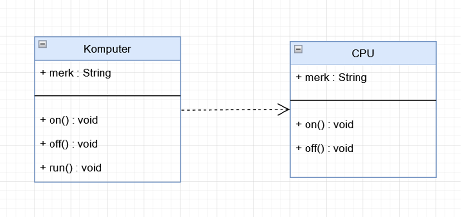
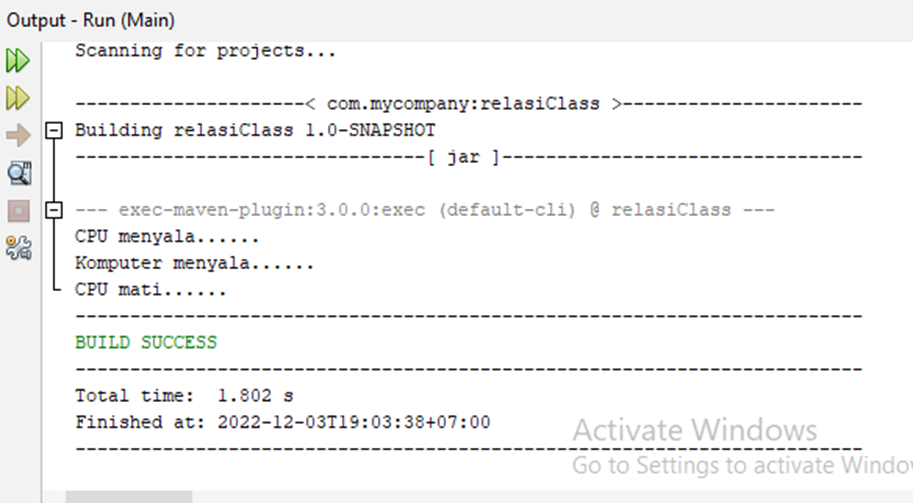
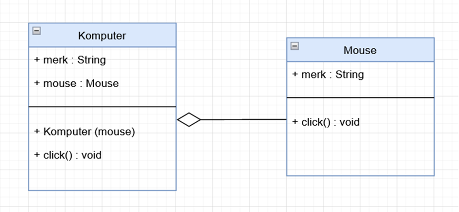
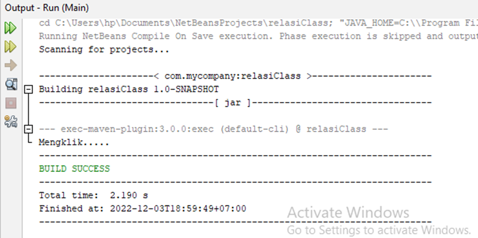
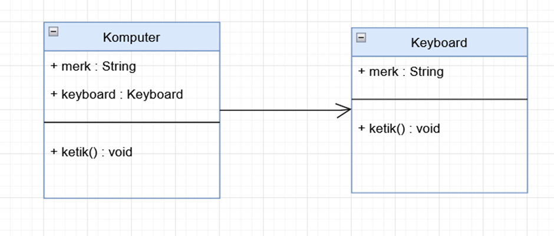
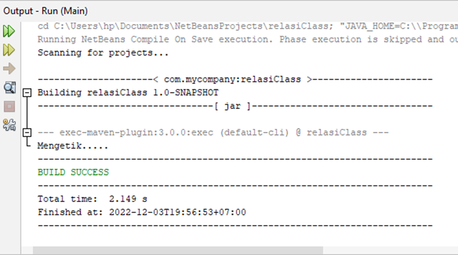

# Praktikum6

## Relasi Class

1. Dependency :

Komputer.java memiliki relasi dependensi dengan CPU.java

Hasil dari program yang sudah dibuat :

2. Aggregation :

Komputer.java memiliki relasi agregasi dengan Mouse.java

Hasil dari program yang sudah dibuat :

3. Association :

Komputer.java memiliki relasi asosiasi dengan Keyboard.java

Hasil dari program yang sudah dibuat :

